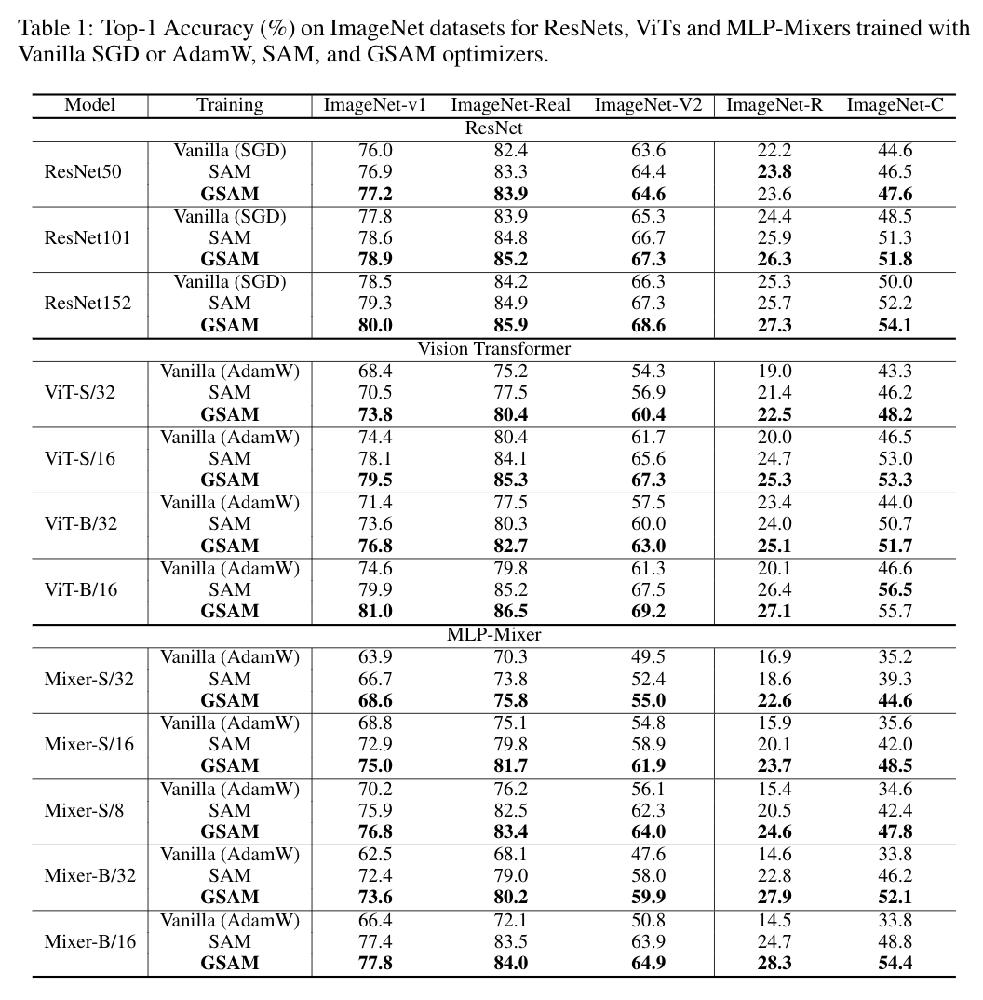

<h1 align="center"><b>GSAM Optimizer</b></h1>
<h3 align="center"><b>Surrogate Gap Guided Sharpness-Aware Minimization </b></h3>
<a href="https://openreview.net/pdf?id=edONMAnhLu-" a> [Paper, ICLR 2022]</a>   <a href="https://sites.google.com/view/gsam-iclr22/home" a> [Webpate] </a>

Disclaimer: original code (during internship at Google) was in jax and tensorflow and is planned to be released with Keras. This repository is a re-implmentation in PyTorch tested only on a Cifar10 experiment, not tested by reproduction of results in the paper

Acknowledgement: This repository is based on https://github.com/davda54/sam 

## (Potentially) Unresolved issues with PyTorch code
Since the SAM family works best when```each worker has its own (different) gradient and weight puerturbation```, but in DataParallel mode in PyTorch the gradient is synchronized across workers hence perturbation is also synchronized across workers.

In order to let each worker use its own gradient, I use ```model.no_sync()``` in the [code](https://github.com/juntang-zhuang/GSAM/blob/7970892956b9159fe5eb1f304f9f956d5b6a8d5f/gsam/gsam.py#L129), perform the gradient decomposition in GSAM for each worker separately, then synchronize the 
 [here](https://github.com/juntang-zhuang/GSAM/blob/7970892956b9159fe5eb1f304f9f956d5b6a8d5f/gsam/gsam.py#L87). However, I'm not sure if ```model.no_sync()``` only works in ```DistributedDataParallel``` mode but not in ```DataParallel``` mode. 

I suppose the training script needs to be set as ```Distributed``` in order to replicate my experiments with Jax, but I have quite limited experimence with PyTorch distributed training.
Please feel free to create a PR if you are an expert on this.

## Experiments (from this repo on Cifar10)

| Optimizer             | Test error rate |
| :-------------------- |   -----: |
| SGD + momentum        |   3.20 % |
| SAM + SGD + momentum  |   2.86 % |
| ASAM + SGD + momentum |   2.55 % |
| GSAM + SGD + momentum |   2.45 % | 

## Algorithm and results on ImageNet in the paper


## How to use GSAM in code
For readability the essential code is highlighted (at a cost of an extra "+" sign at the beginning of line). Please ignore the beginning "+" when using GSAM in your project. Each step of code is marked with notes, please read before using.

```diff
# import GSAM class and scheduler
from gsam import GSAM, LinearScheduler

# Step 0): set up base optimizer, e.g. SGD, Adam, AdaBelief ...
+base_optimizer = torch.optim.SGD(model.parameters(), lr=args.learning_rate, momentum=args.momentum, weight_decay=args.weight_decay)

# Step 1): set up learning rate scheduler. 
# If you pass base_optimizer to lr_scheduler, lr_scheduler.step() will update lr for all trainable parameters in base_optimizer. 
# Otherwise, it only returns the value, and you need to manually assign lr to parameters in base_optimizer.
+lr_scheduler = LinearScheduler(T_max=args.epochs*len(dataset.train), max_value=args.learning_rate, min_value=args.learning_rate*0.01, optimizer=base_optimizer)

# Step 2): set up rho_t scheduler. 
+rho_scheduler = LinearScheduler(T_max=args.epochs*len(dataset.train), max_value=args.rho_max, min_value=args.rho_min)

# Step 3): configure GSAM
+gsam_optimizer = GSAM(params=model.parameters(), base_optimizer=base_optimizer, model=model, gsam_alpha=args.alpha, rho_scheduler=rho_scheduler, adaptive=args.adaptive)

# ============================================================================================
# training loop

for batch in dataset.train:
    inputs, targets = (b.cuda() for b in batch)
    
    # Step 4): Define loss function, so that loss_fn only takes two inputs (predictions, targets), and outputs a scalar valued loss.
    # If you have auxialliary parameters e.g. arg1, arg2, arg3 ..., please define as:
    #           loss_fn = lambda predictions, targets: original_loss_func(predictions, targets, arg1=arg1, arg2=arg2, arg3=arg3 ...)
    
+   def loss_fn(predictions, targets):
+       return smooth_crossentropy(predictions, targets, smoothing=args.label_smoothing).mean()
    
    # Step 5): Set closure, GSAM automatically sets the closure as
    #            predictions = model(inputs), loss = loss_fn(predictions, targets), loss.backward()
    # Note: need to set_closure for each (inputs, targets) pair
    
+   gsam_optimizer.set_closure(loss_fn, inputs, targets)
    
    # Step 6): Update model parameters. 
    # optimizer.step() internally does the following: 
    #            (a) zero grad (b) get gradients (c) get rho_t from rho_scheduler (d) perturb weights (e) zero grad (f) get gradients at perturbed location
    #            (g) decompose gradients and update gradients (h) apply new gradients with base_optimizer
    # Note: zero_grad is called internally for every step of GSAM.step(), gradient accumulation is currently not supported
    
+   predictions, loss = gsam_optimizer.step()

    # Step 7): Upate lr and rho_t
+   lr_scheduler.step()
+   gsam_optimizer.update_rho_t()
# ============================================================================================
```

# Notes on rho_scheduler

### Case 1 (same as in paper for ImageNet experiments):
If you use the same type for lr_scheduler and rho_scheduler, it's equivalent to let rho_t evolves proportionally with 
learning rate, 
```(lr - lr_min) / (lr_max - lr_min) = (rho - rho_min) / (rho_max - rho_min)```

Example to use the same type of scheduler for rho and lr:
```
lr_scheduler = LinearScheduler(T_max=args.epochs*len(dataset.train), max_value=args.learning_rate, min_value=args.learning_rate*0.01, optimizer=base_optimizer, warmup_step=2000)
rho_scheduler = LinearScheduler(T_max=args.epochs*len(dataset.train), max_value=args.rho_max, min_value=args.rho_min, warmup_step=2000)
```
```
lr_scheduler = CosineScheduler(T_max=args.epochs*len(dataset.train), max_value=args.learning_rate, min_value=args.learning_rate*0.01, optimizer=base_optimizer, warmup_step=2000)
rho_scheduler = CosineScheduler(T_max=args.epochs*len(dataset.train), max_value=args.rho_max, min_value=args.rho_min, warmup_step=2000)
```

### Case 2 (used in this toy repo) 
This is used in ```example/train.py```, the lr scheduler is a StepScheduler (to match previous results by https://github.com/davda54/sam ),
the rho_t sheduler is a linear decayed scheduler. lr and rho_t do not decay proportionally.

### Case 3 (write your own scheduler)
You can also write your own shceduler by inherit ```gsam.scheduler.SchedulerBase``` class and define ```step_func```.

## Citation
```
@inproceedings{
zhuang2022surrogate,
title={Surrogate Gap Minimization Improves Sharpness-Aware Training},
author={Juntang Zhuang and Boqing Gong and Liangzhe Yuan and Yin Cui and Hartwig Adam and Nicha C Dvornek and sekhar tatikonda and James s Duncan and Ting Liu},
booktitle={International Conference on Learning Representations},
year={2022},
url={https://openreview.net/forum?id=edONMAnhLu-}
}
```
